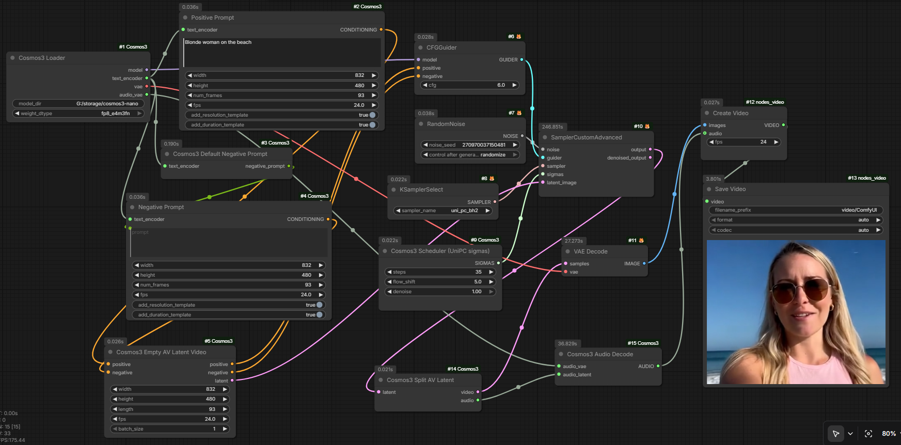

# ComfyUI-Cosmos3

ComfyUI custom nodes for [NVIDIA Cosmos3-Nano](https://huggingface.co/nvidia/Cosmos3-Nano) — a 16B Mixture-of-Transformers world model for
text-to-video, image-to-video, and joint audio-video generation. Cosmos3 runs language and
diffusion tokens through one Qwen3-VL transformer, so there is no separate text encoder.

<p align="center">
  
</p>

<!-- 📸 Add a screenshot: save a workflow / sample output image as assets/example.png -->

## Features

- Text-to-video, image-to-video (first-frame), and audio-video — all through the built-in
  KSampler / SamplerCustomAdvanced stack.
- `fp8_e4m3fn` weights (~14 GB) for 24 GB GPUs; native bf16 otherwise.
- Flow-matching UniPC schedule (shifted, `uni_pc_bh2`) matching NVIDIA's reference inference.

## Install

1. Clone into `ComfyUI/custom_nodes/`.
2. `pip install -r requirements.txt` (just `transformers>=4.51`; torch/safetensors come with ComfyUI).
3. Download **`nvidia/Cosmos3-Nano`** into `ComfyUI/models/cosmos3/Cosmos3-Nano/` (or any path you
   pass to the loader). The loader expects these subfolders:

   ```
   Cosmos3-Nano/
     transformer/   (7-shard safetensors + index + config.json)
     vae/           (diffusion_pytorch_model.safetensors + config.json)
     text_tokenizer/(tokenizer.json, vocab.json, merges.txt, ...)
     assets/        (optional — negative_prompt.json for the default-negative node)
   ```

**Requirements:** ComfyUI ≥ 0.21 · Python ≥ 3.10 · `transformers` ≥ 4.51 ·
24 GB VRAM (use fp8; the bf16 model is ~30 GB and OOM-prone on 24 GB) · ~64 GB system RAM for
bf16 loading (the ~30 GB of shards are held in RAM while copied into the model; fp8 needs less).

## Nodes

| Node | Purpose · key inputs → outputs |
|------|--------------------------------|
| **Cosmos3 Loader** | Load the model. `weight_dtype` = `default` (bf16) or `fp8_e4m3fn` (~14 GB, recommended for 24 GB). → `MODEL`, `COSMOS3_TEXT_ENCODER`, `VAE`, `COSMOS3_AUDIO_VAE` |
| **Cosmos3 Text Encode** | Tokenize a prompt (Qwen2 chat template + optional resolution/duration metadata). Set `width`/`height`/`num_frames`/`fps` to match the latent. → `CONDITIONING` |
| **Cosmos3 Default Negative Prompt** | Returns the model's bundled `assets/negative_prompt.json` as a STRING — wire into a negative Text Encode. → `STRING` |
| **Cosmos3 Empty Latent Video** | Zero latent `[B, 48, (length-1)//4+1, H/16, W/16]`. → `LATENT` |
| **Cosmos3 Image to Video** | First-frame conditioning: encodes the image and attaches it to positive/negative conds. → `CONDITIONING ×2`, `LATENT` |
| **Cosmos3 Scheduler** | Flow sigmas over [1, 0] with discrete shift. Output → `SamplerCustomAdvanced`. → `SIGMAS` |
| **Cosmos3 Empty AV Latent Video** | Packed audio+video latent; routes conds through to attach the sound-token count. → `CONDITIONING ×2`, `LATENT` |
| **Cosmos3 Split AV Latent** | Splits the denoised packed latent into video + audio latents. → `LATENT`, `COSMOS3_AUDIO_LATENT` |
| **Cosmos3 Audio Decode** | Decodes the audio latent to a 48 kHz stereo waveform. → `AUDIO` |

Sampling uses the built-in `CFGGuider` (cfg 6.0) + `SamplerCustomAdvanced` with `KSamplerSelect`
set to **`uni_pc_bh2`**. `VAEDecode` → `CreateVideo` → `SaveVideo` for output.

> **`flow_shift`** in the Scheduler is resolution-dependent: **10 @ 720p, 5 @ 480p, 3 @ 256p**
> (the discrete flow shift used by the reference inference code). `1.0` = no shift.

## Example workflows

| File | What |
|------|------|
| `cosmos3_t2v.json` | Text → video (832×480, 93f) |
| `cosmos3_i2v.json` | Image → video (first-frame conditioning) |
| `cosmos3_t2v_audio.json` | Text → video + audio |

Drag a JSON onto the canvas. **For I2V + audio**, chain Text Encode → Image to Video → Empty AV
Latent Video (use the AV node's latent; discard the I2V one), then sample as usual.

## Recommended settings

35 steps · cfg 6.0 · sampler `uni_pc_bh2` · `flow_shift` 10/5/3 for 720p/480p/256p. 189 frames
(7.9 s @ 24 fps) is the training default; use 93 or fewer on 24 GB cards. Plain text prompts work;
NVIDIA's JSON-upsampled prompts (cosmos-framework) match the training distribution more closely and
can be pasted directly into the prompt field.

On a 24 GB GPU: fp8 weights sit at ~14 GB (peak rises with resolution/frames); bf16 sits right at
the 24 GB edge and is OOM-prone — prefer `fp8_e4m3fn`, fewer frames, and/or `--lowvram`.

## Limitations

- **Audio input** conditioning is unsupported — the checkpoint ships only the AVAE decoder.
- No action conditioning, reasoning/CoT, or super-resolution.

## Troubleshooting

- **OOM:** use `fp8_e4m3fn`; lower `length`/resolution; launch ComfyUI with `--lowvram`.
- **Blurry output:** match `flow_shift` to resolution (10/5/3), raise `steps` to 40–50, try a JSON-upsampled prompt.
- **Wrong duration / flicker:** make `num_frames` (Text Encode) match `length` (latent node), and
  keep both metadata templates on for positive and negative.

## License

MIT (node code) — see [LICENSE](LICENSE). Model weights are NVIDIA's, under OpenMDW-1.1.
